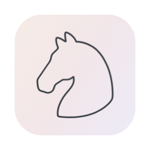

<div align="center">
  
  <h1>HiHaVoice</h1>
  <p>Dictée vocale locale pour macOS — la voix transcrite en texte, quasi instantanément.</p>

  
</div>

---

App macOS de dictée vocale : transcription 100 % locale, amélioration du texte par IA et collage automatique dans l'application active. Sources sous licence GPL v3 ; distribution du binaire prévue via [hi-ha.be](https://hi-ha.be).

## Fonctionnalités

- 🎙️ **Transcription locale** — modèles Whisper (whisper.cpp) et Parakeet (FluidAudio), tout se passe sur la machine, rien ne sort
- ⚡ **Power Mode** — profils appliqués automatiquement selon l'application ou l'URL active
- 🧠 **Contexte intelligent** — l'IA s'adapte au contenu affiché à l'écran
- 🎯 **Raccourcis globaux** — enregistrement rapide et push-to-talk configurables
- 📝 **Dictionnaire personnel** — vocabulaire propre, termes techniques, remplacements de texte
- 🔄 **Modes intelligents** — bascule instantanée entre styles d'écriture optimisés
- 🤖 **Assistant vocal** — mode conversationnel intégré
- 🖥️ **Local CLI** — amélioration du texte via un outil en ligne de commande (Pi, Claude, Codex…)

## Prérequis

- macOS 14.4 ou plus récent
- Xcode récent (pour compiler)

## Compilation

Voir [BUILDING.md](BUILDING.md) pour le détail. En résumé :

```bash
git clone https://github.com/sanma88/hiha-voice-macos.git
cd hiha-voice-macos
make all
```

L'app installée se met à jour via Sparkle (`https://hi-ha.be/voice/appcast.xml`).

## Dépendances

- [whisper.cpp](https://github.com/ggerganov/whisper.cpp) — inférence Whisper haute performance
- [FluidAudio](https://github.com/FluidInference/FluidAudio) — implémentation du modèle Parakeet
- [LLMkit](https://github.com/sanma88/LLMkit) — communication avec les fournisseurs IA
- [Sparkle](https://github.com/sparkle-project/Sparkle) — mises à jour automatiques
- [KeyboardShortcuts](https://github.com/sindresorhus/KeyboardShortcuts) — raccourcis clavier personnalisables
- [LaunchAtLogin-Modern](https://github.com/sindresorhus/LaunchAtLogin-Modern) — lancement à la connexion
- [MediaRemoteAdapter](https://github.com/sanma88/mediaremote-adapter) — contrôle de la lecture média pendant l'enregistrement
- [AXSwift](https://github.com/tisfeng/AXSwift) — API d'accessibilité macOS
- [KeySender](https://github.com/jordanbaird/KeySender) — envoi d'événements clavier
- [SelectedTextKit](https://github.com/tisfeng/SelectedTextKit) — récupération du texte sélectionné
- [Swift Atomics](https://github.com/apple/swift-atomics) — opérations atomiques thread-safe
- [Zip](https://github.com/marmelroy/Zip) — compression/décompression

Les licences de l'ensemble des composants embarqués (y compris la police Inter et le modèle Silero VAD) sont détaillées dans [THIRD-PARTY-LICENSES.md](THIRD-PARTY-LICENSES.md).

## Licence

HiHaVoice est distribué sous licence **GNU General Public License v3 (GPL v3)**.

Ce projet est fondé sur [VoiceInk](https://github.com/Beingpax/VoiceInk), par Beingpax.

- Texte de la licence : [LICENSE](LICENSE)
- Déclaration de version modifiée (conforme GPL v3 §5a) : [NOTICE.md](NOTICE.md)
- Licences des dépendances tierces : [THIRD-PARTY-LICENSES.md](THIRD-PARTY-LICENSES.md)

Les sources de cette version sont disponibles sur ce dépôt.
